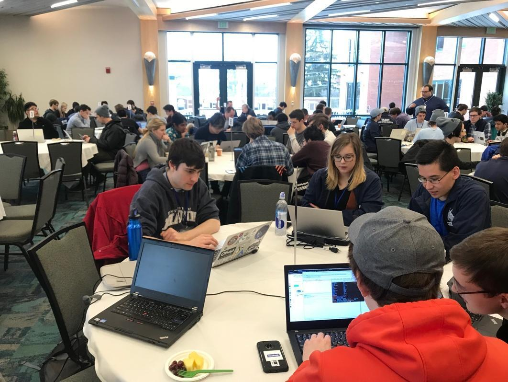

NECCDC would not be possible without the generous support of our sponsors. By becoming involved with this one-of-a-kind event, you have the opportunity to gain access to  of the best and brightest students from colleges around the Northeast, observe the competitors in action, and promote your organization to maximize recruitment effectiveness as well as your increase exposure of your products and services.

<!-- TODO: Get a new image -->

Sponsors have a chance for exclusive resume access, participation in the competition, active collaboration (in-kind donations, training, mentorship, inject development), sharing of job opportunities / company information, and networking with students during the event. Your contributions are essential in creating an improved environment for our students to learn and grow while developing a pipeline for their future success. All funds will be used to support this event. Any additional funds raised will be used to provide educational opportunities for the next generation of cybersecurity professionals.

We would like to welcome and acknowledge our past sponsors who have helped us grow to what we are today. Please contact us if you have been a past sponsor to let us know your thoughts at sponsor@neccdl.org.

## Fund Donation Options:

### PayPal


<form action="https://www.paypal.com/cgi-bin/webscr" method="post" target="_target" style="text-align: center; justify-content: center; padding: 20px; box-shadow: 0 4px 8px rgba(0, 0, 0, 0.1); border-radius: 10px; background-color: #f9f9f9; max-width: 500px; margin: 20px auto;">
  <input type="hidden" name="cmd" value="_s-xclick">
  <input type="hidden" name="hosted_button_id" value="3QASYDNHNYKMS">
    <input type="hidden" name="on0" value="NECCDC Sponsorship Levels">
    <h4>NECCDC Sponsorship Levels</h4>
    <select name="os0" style="width: 100%; padding: 10px; border: 1px solid #ccc; border-radius: 5px; margin-bottom: 20px;
                              background-color: #ffffff; color: #333; font-weight: bold; text-align: center;
                              background-repeat: no-repeat; background-position: right 10px center;">
      <option value="Vibranium" style="color: #333; background-color: #f3f3f3;">Vibranium $35,000.00 USD</option>
      <option value="Platinum" style="color: #333; background-color: #f3f3f3;">Platinum $20,000.00 USD</option>
      <option value="Gold" selected="selected" style="color: #333; background-color: #f3f3f3;">Gold $10,000.00 USD</option>
      <option value="Silver" style="color: #333; background-color: #f3f3f3;">Silver $5,000.00 USD</option>
      <option value="Bronze" style="color: #333; background-color: #f3f3f3;">Bronze $2,000.00 USD</option>
      <option value="Supporter" style="color: #333; background-color: #f3f3f3;">Supporter $500.00 USD</option>
    </select>
    <input type="hidden" name="currency_code" value="USD">
    <input class="button" type="image" src="https://www.paypalobjects.com/en_US/i/btn/btn_buynowCC_LG.gif" border="0" name="submit" 
            alt="PayPal - The safer, easier way to pay online!" style="margin-top: 20px; margin-bottom: 20px;">
     <!-- Tracking pixel -->
</form>



### Alternative Methods
If you wish alternative methods of payment including invoices or direct deposit, please contact sponsor@neccdl.org

 

### Benefits


| | Supporter | Bronze | Silver | Gold | Platinum | Vibranium |
| - | - | - | - | - | - | - |
| **Limit** | Unlimited | Unlimited | Unlimited | 10 | 15 | 2 |
| **Cost** | $500 | $2,000 | $5,000 | $10,000 | $20,000 | $35,000 |
| **Logo & link included on website** |  |  |  |  |  |  |
| **Logo placement in event programming** |  |  |  |  |  |  |
| **Invitations to recruiting dinner** | One | Two | Three | Four | Six | Eight |
| **Student resume booklet** | Regionals | Regionals | Regionals & Qualifiers | Regionals & Qualifiers | Regionals & Qualifiers | Regionals & Qualifiers |
| **White/Orange/Red team participation** | Eligible to apply | Eligible to apply | Eligible to apply | One guaranteed space for a qualified individual | One guaranteed space for a qualified individual | One guaranteed space for a qualified individual |
| **Logo on electronic signage** | |  |  |  |  |  |
| **Booth at recruiting dinner** | | | 6 feet | 6 feet | 12 feet | 12 feet |
| **Logo on select marketing materials** | | |  |  |  |  |
| **Opportunity to supply custom swag** | | |  |  |  |  |
| **Opportunity to display products/literature at the venue** | | | |  |  |  |
| **Space for a banner in the registration and competition areas** | | | | |  |  |
| **Reserved seats at awards banquet** | | | | |  |  |
| **Company logo on event T-shirt** | | | | | |  |
| **Name recognition in title of competition** | | | | | |  |
| **VIP competition Tour** | | | | | |  |
| **Opportunity to present an award** | | | | | |  |
| **Speaking slot** | | | | | |  |

